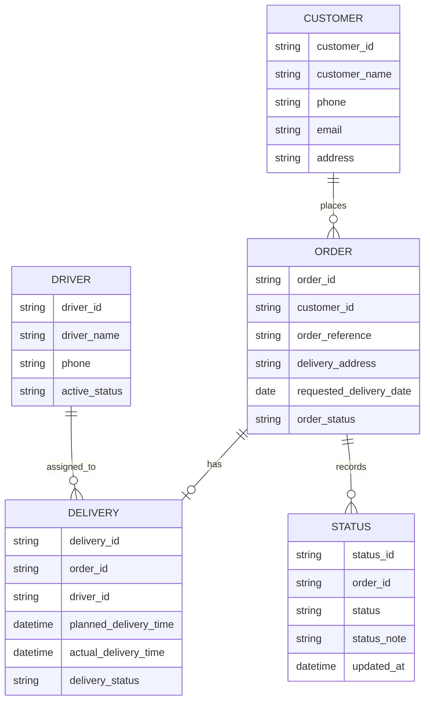

# Data Model

## Logical Entities

## Customer

Represents the customer receiving the delivery.

| Field | Description |
|---|---|
| customer_id | Unique customer identifier |
| customer_name | Customer name |
| phone | Contact phone number |
| email | Contact email address |
| address | Main customer address |

## Order

Represents the customer delivery request.

| Field | Description |
|---|---|
| order_id | Unique order identifier |
| customer_id | Linked customer |
| order_reference | Business or customer reference |
| delivery_address | Address for delivery |
| requested_delivery_date | Requested delivery date |
| order_status | Current order status |
| created_at | Date and time order was created |
| created_by | User who created the order |

## Delivery

Represents the planned delivery activity for an order.

| Field | Description |
|---|---|
| delivery_id | Unique delivery identifier |
| order_id | Linked order |
| driver_id | Assigned driver |
| planned_delivery_time | Planned delivery date and time |
| actual_delivery_time | Actual completed delivery time |
| delivery_status | Current delivery status |
| delay_reason | Reason for delay, if applicable |

## Driver

Represents a company driver.

| Field | Description |
|---|---|
| driver_id | Unique driver identifier |
| driver_name | Driver name |
| phone | Driver contact number |
| active_status | Whether driver is available |

## Status

Represents the history of status changes.

| Field | Description |
|---|---|
| status_id | Unique status record |
| order_id | Linked order |
| status | New status value |
| status_note | Optional note |
| updated_by | User who made the update |
| updated_at | Date and time of update |

## Entity Relationship Overview

