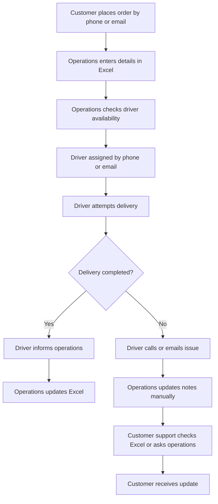
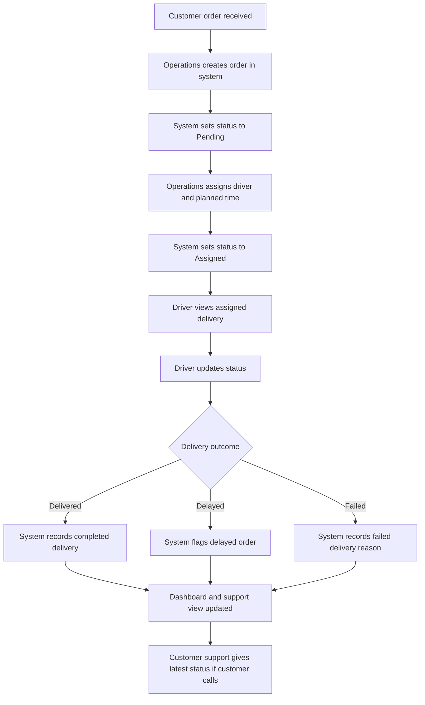

# Process Flows

## Current Process

```mermaid
flowchart TD
    A[Customer places order by phone or email] --> B[Operations enters details in Excel]
    B --> C[Operations checks driver availability]
    C --> D[Driver assigned by phone or email]
    D --> E[Driver attempts delivery]
    E --> F{Delivery completed?}
    F -- Yes --> G[Driver informs operations]
    G --> H[Operations updates Excel]
    F -- No --> I[Driver calls or emails issue]
    I --> J[Operations updates notes manually]
    J --> K[Customer support checks Excel or asks operations]
    K --> L[Customer receives update]
```

## Future Process

```mermaid
flowchart TD
    A[Customer order received] --> B[Operations creates order in system]
    B --> C[System sets status to Pending]
    C --> D[Operations assigns driver and planned time]
    D --> E[System sets status to Assigned]
    E --> F[Driver views assigned delivery]
    F --> G[Driver updates status]
    G --> H{Delivery outcome}
    H -- Delivered --> I[System records completed delivery]
    H -- Delayed --> J[System flags delayed order]
    H -- Failed --> K[System records failed delivery reason]
    I --> L[Dashboard and support view updated]
    J --> L
    K --> L
    L --> M[Customer support gives latest status if customer calls]
```

