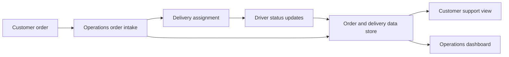

# Order Fulfillment and Delivery Tracking Analysis

## Project Overview

This repository defines the requirements and system design for an internal order fulfillment and delivery tracking workflow. The proposed system replaces scattered spreadsheets, email updates, and phone follow-ups with a controlled operating model for order intake, assignment, delivery status updates, customer support visibility, and management reporting.

Key capabilities:

- Current-state and future-state process analysis.
- Business, functional, and system requirements.
- User stories, acceptance criteria, and sprint planning.
- Logical data model and API overview.
- Operations dashboard mockup and sample delivery data.
- Stakeholder analysis and scope decisions.

## Architecture

The repository documents a proposed application architecture rather than shipping an executable service.



End-to-end pipeline:

1. Operations creates or imports an order.
2. The system validates required customer, address, delivery, and priority fields.
3. A delivery is assigned to a driver or route.
4. Drivers update status as work progresses.
5. Support and operations users search order status from a shared source.
6. Managers review workload, delays, and completion metrics.

## Tech Stack

| Layer | Tooling | Purpose |
|---|---|---|
| Requirements | Markdown | BRD, FRD, SRS, user stories, acceptance criteria |
| Diagrams | Mermaid | Process flows and solution communication |
| Data artifact | CSV | Sample order and delivery records |
| API design | Markdown | Endpoint concepts and payload-level thinking |
| Runtime | Not applicable | No executable application is included |

## Data Flow

1. Ingestion: customer orders enter through operations intake or a future API/import process.
2. Processing: order details are validated, prioritized, assigned, and updated through delivery statuses.
3. Storage: the proposed data model stores orders, deliveries, drivers, customers, and status history.
4. Transformation: dashboard metrics summarize active deliveries, delayed orders, completion rate, and workload.
5. Serving: support, operations, drivers, and managers use role-specific views over the same operational data.

## Setup Instructions

### Prerequisites

- Markdown viewer or editor
- Mermaid-compatible viewer for diagrams
- Spreadsheet tool for opening sample CSV data

### Environment Variables

No environment variables are required. The repository has no runtime service.

### Docker Setup

Docker is not required for this documentation repository.

### Local Run Steps

Start with `business-requirements-document.md`, then read the supporting requirements, process, data model, API, and delivery-planning files.

## Project Structure

```text
.
|-- business-requirements-document.md      # Business goals, scope, and value
|-- functional-requirements-document.md    # Functional behavior by area
|-- system-requirements-specification.md   # System requirements and constraints
|-- process-improvement-analysis.md        # Current vs future process
|-- process-flows.md                       # Process diagrams
|-- agile-user-stories.md                  # Product backlog stories
|-- acceptance-criteria.md                 # Testable acceptance criteria
|-- logical-data-model.md                  # Proposed entities and relationships
|-- api-overview.md                        # High-level API contract concepts
|-- stakeholder-analysis.md                # Stakeholders and needs
|-- agile-delivery-plan.md                 # Sprint and release plan
|-- artifacts/
|   |-- operations-dashboard-mockup.md     # Dashboard concept
|   |-- sample-order-delivery-data.csv     # Sample operational data
```

## Key Components

### ETL Pipeline

No ETL pipeline is implemented. The proposed future system could ingest orders from manual entry, CSV upload, or an external order source and transform them into normalized order and delivery records.

### Streaming Pipeline

No streaming pipeline is included. A future implementation could stream driver status updates or publish delivery-delay events.

### dbt Models

No dbt models are included. Future analytics models could calculate delivery SLA performance, delay reasons, driver workload, and order volume trends.

### API Layer

`api-overview.md` defines conceptual endpoints for orders, deliveries, drivers, status updates, and dashboards. It is intended to guide future implementation rather than act as runnable code.

### Data Quality Checks

Recommended checks include required customer details, valid delivery address, valid status transitions, assigned driver before dispatch, timestamped status updates, and delay reason capture.

## Testing

There are no automated tests. Requirements quality can be reviewed through traceability between business goals, user stories, acceptance criteria, data model, process flows, and API concepts.

## Troubleshooting

| Issue | Fix |
|---|---|
| Scope feels too large | Re-check first-release scope in the delivery plan |
| API concepts do not match requirements | Trace each endpoint back to FRD/SRS behavior |
| Dashboard metrics are unclear | Validate that the sample data includes the fields needed to calculate them |
| Process diagrams do not render | Use a Mermaid-compatible Markdown viewer |

## Future Improvements

- Add OpenAPI-style endpoint definitions.
- Add a normalized sample database schema.
- Convert dashboard mockups into wireframes.
- Add route optimization and GPS as later-release modules.
- Add customer-facing delivery tracking requirements.
- Add event definitions for delivery-delay notifications.
