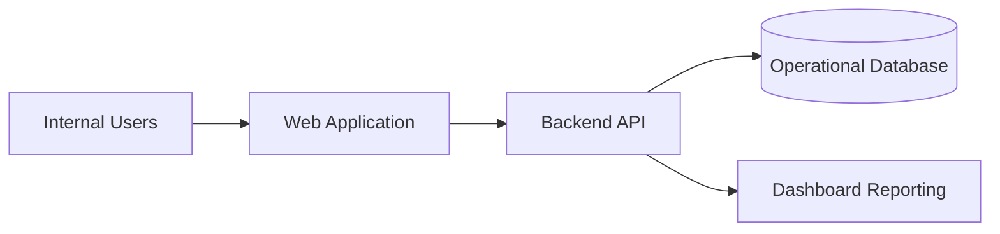

# System Requirements Specification

## System Overview

The Order Fulfillment & Delivery Tracking System is an internal web-based business system for managing customer orders and delivery progress.

It supports order creation, driver assignment, delivery status updates, customer support lookup, and operational reporting.

The first release is intended for internal users only. It should replace the current Excel and email-based tracking process used by operations and customer support.

## Architecture Overview

The proposed architecture is simple:

- Web application for internal users
- Backend API for order, delivery, driver, and status functions
- Relational database for operational records
- Role-based access for different user groups
- Optional future integration with customer notifications

## Functional Requirements

| ID | Requirement |
|---|---|
| SR-F01 | The system shall allow authorised users to create delivery orders. |
| SR-F02 | The system shall generate a unique order ID for each order. |
| SR-F03 | The system shall allow operations users to assign orders to drivers. |
| SR-F04 | The system shall allow status updates across the delivery lifecycle. |
| SR-F05 | The system shall store status history for each order. |
| SR-F06 | The system shall allow users to search orders by ID, customer, or location. |
| SR-F07 | The system shall display delayed deliveries clearly. |
| SR-F08 | The system shall provide dashboard KPIs for daily operations. |
| SR-F09 | The system shall restrict access based on user role. |
| SR-F10 | The system shall allow basic driver workload visibility. |

## Non-Functional Requirements

| Category | Requirement |
|---|---|
| Usability | Operations users should be able to create and assign an order with minimal training. |
| Performance | Order search should return results within three seconds for normal usage. |
| Availability | The system should be available during business operating hours. |
| Security | Users must log in before accessing order or customer data. |
| Auditability | Status changes must be timestamped and linked to a user. |
| Data Quality | Required fields must be validated before an order is saved. |
| Maintainability | Business rules such as status values should be easy to update. |
| Scalability | The system should support increased order volume as the company grows. |

## User Roles

| Role | Access |
|---|---|
| Operations Coordinator | Create orders, assign deliveries, update orders |
| Operations Manager | View all orders, dashboard, exceptions, driver workload |
| Customer Support Agent | Search orders and view customer-facing status |
| Driver | View assigned deliveries and update status |
| Administrator | Manage users and reference data |

## System Constraints

- First release must not depend on live GPS tracking.
- Customer portal is not included in the first release.
- Existing Excel records may be imported only if clean enough for migration.
- The system must be usable on standard office laptops.
- Driver update screens should work on mobile browsers where possible.

## Assumptions

- Users will have company accounts for login.
- Drivers will have access to a phone or tablet for status updates.
- Operations staff will confirm order data before creating an order.
- Customer notification templates will be handled in a later phase.
- Reporting needs for the first release are limited to operational KPIs.

